## Movimiento de personajes. Dibujos Geométricos.

Vamos a aprender a mover nuestros personajes por el escenario.

Veremos que podemos hacerlo de diferentes formas: con **movimientos absolutos**, usando las coordenadas (x,y) y también con **movimientos relativos**, dando **N** pasos desde la posición actual en la dirección en la que apunta el personaje.

También veremos cómo hacer para que nuestro personaje gire, apuntando en distintas direcciones.

### Coordenadas

Empezamos por ver el sistema de coordenadas que utiliza Scratch:

Las coordenadas del escenario de Scratch son las siguientes:

* La coordenada horizontal **X** entre -240 y 240
* La coordenada vertical **Y** entre -180 y 180
* Estando el punto **(0,0)** es el centro de la pantalla.

### Movimientos

Vamos a ver las distintas formas de mover nuestro personaje.

#### Movimientos absolutos

Decimos que el movimiento es absoluto cuando se indican las coordenadas **X** e **Y** que tendrá el personaje. 

* *Ir a (x,y)* es instantáneo, como un "teletransporte".
* *Deslizar*: va moviendo poco a poco desde la posición inicial hasta la coordenada indicada en el tiempo que le hemos dicho.

Si damos varias órdenes de movimiento, estas se realizarán de manera consecutiva. Si son varias "Ir a" al hacerse tan rápido, quizás solo veamos la última posición.

#### Direcciones/Orientación (en grados)

Además de movernos podemos hacer que el personaje apunte en una dirección dada entre 0 y 360 grados. Estas son 4 posiciones para giros de 90º.

Podemos apuntar en cualquier dirección (Puede ser cualquier valor) usando el bloque "apuntar en dirección"

Al pulsar sobre el valor aparecerá un selector de ángulo que nos facilita la tarea.

#### Movimiento relativos

Los movimientos relativos se hacen a partir de la posición y dirección actual, y se indican cuantos grados se quiere girar a partir de la orientación actual o cuantos pasos avanza en la dirección en la que está actualmente apuntando.

Para ello tenemos los siguientes bloques:

#### Tipos de rotaciones

Al rotar el personaje, el disfraz de este gira también. Por eso existen diferentes tipos de rotaciones de disfraz, unas más indicadas para cada tipo de disfraz, como veremos. 

Podemos seleccionar el tipo pulsando sobre alguna de las 3 opciones que aparecen bajo el selector de ángulo.

El tipo de rotación **Giro** rota el disfraz actual de nuestro personaje los grados indicados:

El tipo de rotación **horizontal** sólo tiene en cuenta el signo de los grados indicados, haciendo que el disfraz "mire" hacia la izquierda cuando el signo es negativo y hacia la derecha cuando es positivo:

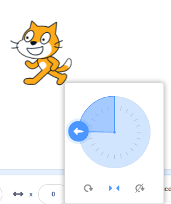

Si no queremos que el disfraz se modifique con las rotaciones usaremos **Sin rotación**.

También podemos fijar este tipo de rotación con este bloque:

¡¡Cuidado!! ¡Los giros no afectan igual a todos los personajes!

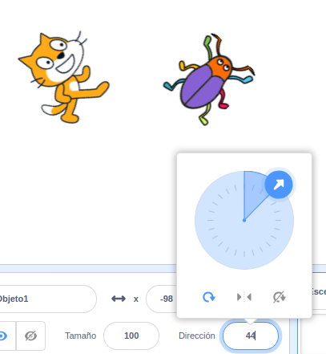

Hay disfraces diseñados para poder moverse en cualquier dirección otros pensados para verlos lateralmente. Busca los distintos disfraces de Gato en la biblioteca de personajes y verás las distintas opciones.

[Vídeo: Movimiento de personajes](https://youtu.be/4O_lxBaApnY)

### Ejemplo: movámonos alrededor del escenario

Vamos a poner en práctica estos movimientos moviendo nuestro personaje alrededor de toda la pantalla formando un rectángulo.

Usa si quieres el [fondo de coordenadas](./images/CoordenadasScratch_sinGato.png)

#### Movimientos absolutos

En este primer ejemplo utilizaremos bloques con movimientos absolutos.

Vamos a elegir un personaje que podamos girar en cualquier dirección, porque su disfraz parezca que se ve desde arriba, como es "Escarabajo"

Para encontrar los valores adecuados de las coordenadas  movemos nuestro personaje con el ratón por el escenarios, tomando nota de las coordenadas **X** e **Y** que aparecen debajo del Escenario.

Para movernos de una posición a otra usaremos "Deslizar ..." y así podremos ver el movimiento. 

Tras cada movimiento giramos el personaje para que parezca que se mueve en esa dirección.

El programa queda muy sencillo:

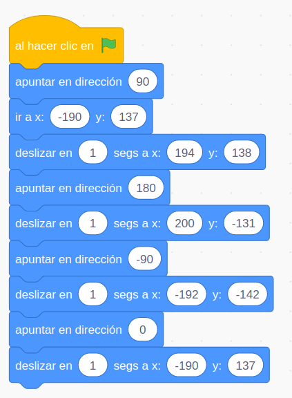

[Programa: Movimientos Absolutos](https://scratch.mit.edu/projects/394209879/)

[Vídeo: Movimientos absolutos del personajes por el escenario](https://youtu.be/dEVWnlP5EGk)

#### Movimientos relativos

Vamos a hacer ahora el mismo recorrido pero usando movimientos relativos. Iremos girando 90º y moviéndonos un cierto número de pasos.

Hemos intercalado unas esperas entre los movimientos para poder apreciarlo más fácilmente.

El programa queda sencillo, pero repetitivo...

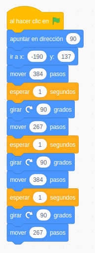

[Programa: Movimientos Relativos](https://scratch.mit.edu/projects/394215273/)

[Vídeo: Movimientos relativos](https://youtu.be/qC9IGAoevLw)

#### Repetición con bucles

Si en lugar de movernos con forma de rectángulo nos movemos haciendo un cuadrado, veremos que nuestro programa es muy repetitivo.

Es algo muy frecuente tener que repetir un grupo de bloques varias veces. Por eso existen en la paleta de control los bloques "Repetir". 

Vemos que muchos de estos bloques tienen forma de "C". El hueco central es donde pondremos todos aquellos bloques que queremos repetir.

Uno de los más utilizados es el bloque "Repetir N veces", que será el adecuado para nuestro caso usando 4 repeticiones de los 3 bloques:

El programa queda así de sencillo:

[Programa: Dibujando Cuadrados](https://scratch.mit.edu/projects/394066829/)

[Vídeo: Bucle repetición](https://youtu.be/_QsXbvNzuzE)

### Pintando cuadrados

Ya que sabemos mover nuestros personajes por la pantalla, vamos a utilizar para dibujar sobre ella. Haremos que al moverse dejen un rastro formando dibujos y figuras geométricas.

Para ello usaremos la extensión **Lápiz**. Una extensión es un complemento de Scratch que añade bloques con nuevas funcionalidades. Hay extensiones para dibujar, para hacer música, para controlar dispositivos como Lego o micro:bit.

Podemos añadir extensiones pulsando el botón azul abajo a la derecha

Pulsamos y añadimos la extensión "**Lápiz**"

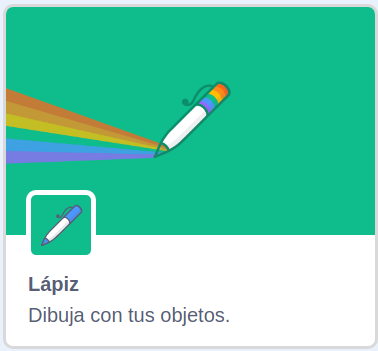

Al seleccionarla nos aparecerá una nueva paleta de bloques con los siguientes:

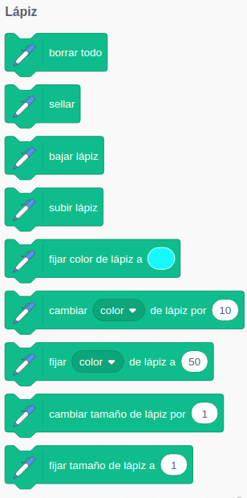

[Pintamos un cuadrado](https://scratch.mit.edu/projects/394212879/)

Vemos que hay bloques para **cambiar el grosor** o el **color** del lápiz, para **bajar** (deja rastro) o **subir el lápiz** cuando queremos que nuestro personaje no deje rastro al moverse.

Vamos a usarlo para dibujar un cuadrado en pantalla. Aprenderemos:

* A incluir más bloques con una extensión.
* A usar la extensión **Lápiz** para dibujar.
* A que hay que bajar el lápiz para dejar rastro.
* A borrar la pantalla (mejor al principio del programa)
* Los colores de la paleta de colores están ordenados de 0 a 100, siendo rojo en los dos extremos y verde/azul en el centro:

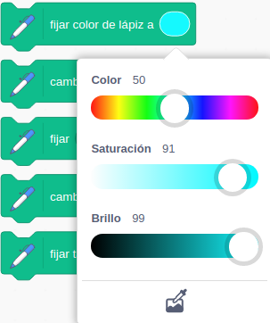

* A seleccionar color y grosor del lápiz.
* A modificar el color del lápiz.
    * Podemos **fijar** un color.
    * **Cambiar** el color, incrementando su valor.

[Vídeo: Pintando Cuadrados](https://youtu.be/VppOn52tlpQ)

### Pintando polígonos

Vamos a generalizar el programa que dibuja cuadrados para que nos permita dibujar polígonos de cualquier número de lados.

Para ello haremos una copia del programa que dibuja cuadrados para trabajar sobre él.

Lo vamos a revisar para pensar qué habría que cambiar si queremos dibujar un hexágono...

Vemos que claramente tendríamos que cambiar el número de repeticiones, que será el número de lados de nuestro polígono y el ángulo que giramos.

Si repasamos algo de geometría veremos que el giro también depende del número de lados y que es 360º dividido entre el número de lados

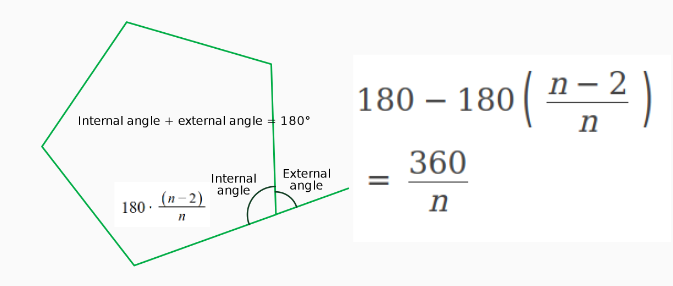

Comprobamos que para el caso del cuadrado concuerda con los 90º que girábamos.

Podemos comprobar que funciona poniendo 6 en el número de repeticiones y calculando el ángulo de giro y poniéndolo en el bloque "girar ".

Para hacer este cálculo podemos usar operadores aritméticos en la paleta "Operadores" y así usando el operador división sustituimos el ángulo por:

Vemos que tenemos el bucle de la siguiente forma:

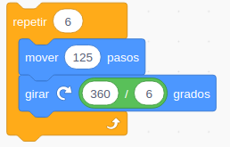

El número de repeticiones siempre será igual al que usamos para calcular el ángulo. 

### Variables

Tenemos ya claro lo que tenemos que hacer para un polígono genérico. Esta forma de pensar abstracta es lo que se conoce como **Algoritmo**: el listado de los distintos pasos que tenemos que hacer para completar una tarea de forma abstracta.

Vamos a trabajar un poco en abstracto, algebráicamente, suponiendo que el número de lados es NumeroLados y para ello vamos a crear una **Variable**: una cajita con un nombre, donde podemos guardar un valor. De esta manera podremos definir todo en el proceso en función de **NumeroLados** sin tener que especificar un valor concreto.

Vamos a la paleta **Variables** pulsamos "Crear una variable":

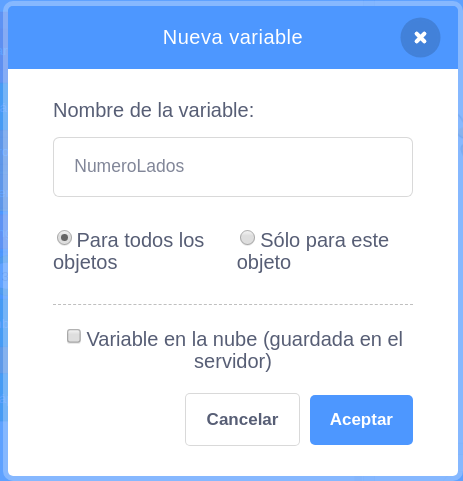

(Más adelante veremos la distintas opciones)

Ahora nos aparecen varios bloques:

* **Dar valor a**: nos permite asignar un valor a la variable. Siempre tenemos que utilizar este bloque para dar un valor a la variable antes de usarla. Si no lo hacemos ésta valdrá 0. Es un bloque con la típica forma rectangular de todos los bloques que representan **acciones**.

* **NumeroLados**: nos permite usar el valor de la variable y que será el que empleemos en los cálculos. Este bloque tiene forma redondeada, como los huecos donde tenemos que poner los valores de las cosas. Es un bloque de tipo **Valor**.

Y otros bloques que ya iremos viendo más adelante.

El bucle quedará ahora así:

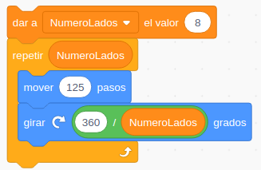

Donde hemos dado un valor a la variable NumeroLados y utilizamos su valor en el cálculo, para lo que habremos arrastrado el bloque redondeado "NumeroLados" en los correspondientes huecos.

Vemos que estamos calculando el ángulo que tenemos que girar que será 360/NumeroLados.

Para terminar vamos a añadir un **Comentario**: Una indicación que incluímos en nuestro programar como información extra para quien lo vea. Los comentarios no son instrucciones para el ordenador, son aclaraciones para las personas que vean el programa.

Hemos aprendido a calcular usando los operadores algebráicos.

El programa completo queda así:

[Programa Pintado Polígonos](https://scratch.mit.edu/projects/39420307)

Vemos la potencia para trabajar la geometría con Scratch.

[Vídeo: Pintando polígonos](https://youtu.be/xgVTnHNKFyo)

### La mochila de Scratch 3.0

Una de las novedades más interesantes de Scratch 3.0 y que más me inclinan por usar la versión online es la posibilidad de compartir partes de programas entre ellos. 

Para hacerlo podemos utilizar la **mochila**, un panel que aparece en la parte más baja de la web cuando entramos en la página de Scratch 3.0 utilizando nuestra cuenta.

Si hacemos clic sobre ella se abrirá y nos mostrará una espacio donde podemos guardar bloques o recortes de programa que nos puede interesar compartir entre proyectos o que pensamos que nos pueden ser útiles más adelante.

Para guardar un grupo de bloque sólo tenemos que arrastrarlos sobre la **mochila** abierta.

Para recuperarlos abrimos el panel de la **mochila** y arrastramos el grupo de bloques sobre nuestro programa.

Lamentablemente a día de hoy no se puede dar un nombre a los bloques con lo que si tenemos varios no es fácil distinguir cuál es cuál.

Vamos a aprender a usar la mochila, que nos permite compartir grupos de bloques entre diferentes proyectos, a mi juicio, es una de las mayores ventajas del uso de la versión online.

[Vídeo: Uso de la mochila](https://youtu.be/T8OXsgJQRbI)

### Dibujos complejos estilo Spirograph

[Spirograph](https://es.wikipedia.org/wiki/Espir%C3%B3grafo) es un juguete para hacer dibujos complejos a bolígrafo. La idea es hacer muchas figuras similares pero rotadas unos pocos grados una de otra:

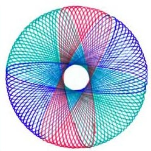

Aprovechando que sabemos dibujar polígonos, vamos a hacer muchos de ellos rotando unos grados entre ellos.

Para ello vamos a añadir un bucle que haga que se repitan todos los bloques que dibujan el polígono y entre uno y otro rotemos unos grados.

Vamos aprender algunas cosas:

* Cómo descargar un programa
* Recuperar objetos borrado
* Usaremos Bucles anidados.
* Usaremos la mochila para recuperar unos bloques de código que creamos en otro proyecto y que nos permitían dibujar polígonos.
* Añadimos un giro y un bucle que repite todo el proceso.
* Guardamos en nuestro disco duro el programa
* Vemos cómo copiar los bloques de un objeto a otro

El programa quedará finalmente así:

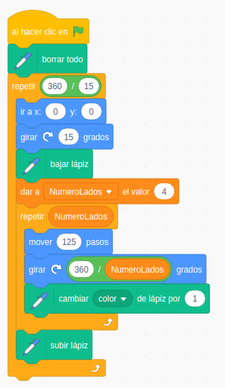

[Programa Spirograph](https://scratch.mit.edu/projects/394219217)

[Vídeo: dibujando estrellas complejas](https://youtu.be/tzjHbXfAJFA)

#### Mejoras/ideas

* Podemos usar otro tipo de polígono para hacer la repetición.
* ¿y si no volvemos al punto (0,0) en cada iteración.

### Tarea 4.1: Dibujar una estrella

**No dar demasiadas explicaciones de cómo hacerlo**
